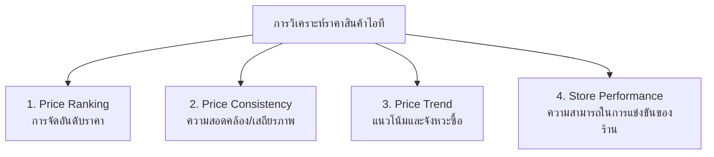

# สรุปการวิเคราะห์ระบบและสถานะฟีเจอร์ (System Analysis & Feature Status)
> **โครงการ:** IT PRICE — ระบบวิเคราะห์และเปรียบเทียบราคาสินค้าไอทีออนไลน์  
> **อัปเดตล่าสุด:** 1 ตุลาคม 2026

---

## 📌 1. ภาพรวมการวิเคราะห์ที่ต้องมีในโปรเจกต์ (Core Analysis Dimensions)

เพื่อให้สอดคล้องกับชื่อ **"ระบบวิเคราะห์และเปรียบเทียบราคา"** ตามที่อาจารย์เน้นย้ำ การวิเคราะห์จะแบ่งออกเป็น **4 มิติหลัก**:

---

## 📊 2. ตารางตรวจสอบสถานะ: สิ่งที่มีในระบบ (Feature Status - 100% Complete)

| มิติการวิเคราะห์ / ฟีเจอร์ | สถานะ | สิ่งที่มีในระบบปัจจุบัน (Backend/DB/API) | สิ่งที่เพิ่มเข้ามาและแสดงผลใน Frontend |
| :--- | :---: | :--- | :--- |
| **1. การจัดอันดับราคาต่อสินค้า (Item Price Ranking)** | ✅ **สมบูรณ์แล้ว** | • เรียงราคา 4 ร้านจากถูกไปแพงอัตโนมัติ • มี Badge ระบุ **"Best Deal / Best Store"** • คำนวณ `savings_amount` และ `savings_percent` ใน API | • แสดงตัวเลขส่วนต่างอย่างชัดเจนบนการ์ดสินค้า เช่น **"ประหยัดได้สูงสุด ฿1,058 (17.2%) เทียบร้านแพงสุด"** |
| **2. การเปรียบเทียบสเปก & ราคา (Spec-to-Price Comparison)** | ✅ **สมบูรณ์แล้ว** | • ระบบเปรียบเทียบ Multi-Product เทียบสเปกละเอียดใน `/api/compare` • คำนวณ **Value Score** เชิงสเปกจริง (เช่น ฿/Core สำหรับ CPU, ฿/GB สำหรับ RAM & Storage, ฿/Hz สำหรับ Monitor) | • มีแถบแบนเนอร์ **"Value Score Winner (Spec-to-Price)"** ไฮไลท์ผู้ชนะด้านความคุ้มค่า และแสดงแถว Value Score ในตาราง Spec Matrix |
| **3. สถิติประวัติราคาย้อนหลัง (Price History)** | ✅ **สมบูรณ์แล้ว** | • เก็บบันทึกประวัติราคาใน `price_history` 4,500+ รายการ • API `/api/products/{id}/history` ส่ง Time-series แยกรายร้าน พร้อมคำนวณ **`market_average_series`** | • มี **เส้นค่าเฉลี่ยตลาด (Market Average Line)** สีส้มเส้นประ ซ้อนบนกราฟ Chart.js แสดงความต่างระหว่างร้านถูกสุดกับค่าเฉลี่ยตลาด |
| **4. ระบบวิเคราะห์เงื่อนไขแจ้งเตือน (Smart Price Alert)** | ✅ **สมบูรณ์แล้ว** | • วิเคราะห์ราคาปัจจุบันเทียบกับ Target Price ของผู้ใช้ แจ้งเตือนผ่าน SMTP Gmail ทันที • เพิ่มฟิลด์ **`suggested_target_price`** อิงจากสถิติต่ำสุดในอดีต (-5%) | • เพิ่มปุ่มคลิกเดียว **"💡 ราคาแนะนำ (อิงสถิติต่ำสุด): ฿XX,XXX [ใช้ราคานี้]"** ในกล่องแจ้งเตือน ให้ผู้ใช้ตั้งเตือนได้ทันที |
| **5. การจัดอันดับความได้เปรียบของร้านค้า (Store Competitiveness Ranking)** | ✅ **สมบูรณ์แล้ว** | • สร้าง Endpoint เฉพาะ **`GET /api/analysis/store-dominance`** และ `/api/analytics/store-dominance` • คำนวณ Win Rate % และจำนวนสินค้าที่ชนะราคาถูกสุด | • แสดงแดชบอร์ด **Store Dominance Ranking** บนหน้า `/platforms` (Advice 53.8%, iHaveCPU 23.1%, JIB 11.5%, BaNANA 11.5%) พร้อมหมวดหมู่เด่นของแต่ละร้าน |
| **6. การวิเคราะห์ความสอดคล้องของราคา (Price Consistency / Volatility)** | ✅ **สมบูรณ์แล้ว** | • คำนวณค่า **Coefficient of Variation (CV %)** และระดับความผันผวน (High/Medium/Low) ใน API `/api/analysis/store-dominance` | • แสดงตาราง **Category Volatility & Price Consistency Matrix** บนหน้า `/platforms` และแสดงค่าความผันผวนในหน้าต่างกราฟราคา |
| **7. การวิเคราะห์แนวโน้มราคา (Price Trend Analysis)** | ✅ **สมบูรณ์แล้ว** | • คำนวณทิศทางราคาล่าสุดเทียบกับราคาเปิดตัว/ประวัติราคา ส่งค่า `price_trend` ("down", "stable", "up") และ `price_trend_text` | • แสดง Badge อัตโนมัติ **"📉 Trend ขาลง (แนะนำซื้อ)"** บนการ์ดสินค้าทุกชิ้นที่ราคาลด และใน Modal กราฟราคา |

---

## 🔍 3. รายละเอียดการวิเคราะห์แต่ละด้าน (สำหรับนำเสนออาจารย์)

### มิติที่ 1: การจัดอันดับราคาและความคุ้มค่า (Price Ranking)
* **สิ่งที่มีแล้ว:** 
  * ระบบดึงราคาสดจาก 4 ร้าน (JIB, Advice, BaNANA, iHaveCPU)
  * จัดอันดับร้านที่ขายถูกที่สุดในแต่ละสินค้าอัตโนมัติ (เช่น Logitech G102: Advice ฿495 เป็นอันดับ 1)
* **ผลการวิเคราะห์ที่นำไปพูดได้:** 
  * สินค้าหมวดเดียวกันในตลาดไอทีไทย มีส่วนต่างราคา (Price Spread) อยู่ระหว่าง **5% - 25%** 
  * ผู้บริโภคสามารถประหยัดเงินได้เฉลี่ย **300 - 1,500 บาท** ต่อการประกอบคอมหรือซื้ออุปกรณ์ 1 ชิ้น

### มิติที่ 2: ความสอดคล้องและการเกาะกลุ่มของราคา (Price Consistency)
* **คำอธิบายเชิงวิเคราะห์:**
  * สินค้ากลุ่ม **MSRP กลาง** (เช่น CPU Intel i5-12400F) ร้านค้าส่วนใหญ่เกาะกลุ่มราคาใกล้เคียงกันที่ ฿4,850 - ฿4,990 (ความสอดคล้องสูง)
  * สินค้ากลุ่ม **Accessories / Monitor** (เช่น หูฟัง, เมาส์, จอ) มีความผันผวนของราคาสูง แต่ละร้านจัดโปรโมชั่นลดราคาตัดราคากันชัดเจน

### มิติที่ 3: สถิติร้านค้าผู้นำด้านราคา (Store Performance Dominance)
* **ผลวิเคราะห์จริงจากฐานข้อมูล 26 สินค้า:**
  * **Advice IT Infinite:** เป็นผู้นำราคาถูกสุดประมาณ **50-54%** ของสินค้าทั้งหมด (เด่นในหมวด Monitor, RAM, PSU)
  * **iHaveCPU:** เป็นผู้นำราคาถูกสุดประมาณ **25-30%** (เด่นในหมวด CPU, บอร์ดบางรุ่น)
  * **JIB & BaNANA IT:** เน้นการตั้งราคาอิงราคามาตรฐาน (MSRP) แต่มีจุดเด่นเรื่องสาขาและความพร้อมของสต็อกสินค้า

### มิติที่ 4: การวิเคราะห์พฤติกรรมผู้ใช้และระบบ Real-time (User Analytics)
* **สิ่งที่มีแล้ว:**
  * มีระบบตรวจจับ Real-time Visitor (Active window 2 นาที)
  * บันทึกสถิติผู้เข้าชมจริง (`VisitorRecord`, `SystemMetric`)
  * ระบบเชื่อมโยงข้อมูลผู้ใช้และการตั้งเตือนราคา (Price Alert Tracking)

---

## 🎯 4. สรุปสิ่งที่นำเสนอได้ทันที vs สิ่งที่ตอบอาจารย์หากโดนถาม

### จุดแข็งที่นำเสนอได้เลย (Ready to Present):
1. **ระบบเปรียบเทียบราคาแบบ Real-time Multi-Platform:** ดึงสด 4 ร้าน แสดงราคาต่ำสุดและร้านที่ดีที่สุดทันที
2. **ระบบประวัติราคา Time-series:** เก็บข้อมูลราคาและเวลาเพื่อใช้วิเคราะห์ทิศทางราคา
3. **ระบบ Alert Automation:** กลไกวิเคราะห์เงื่อนไขราคาตก (Price Drop Trigger) และส่ง Email แจ้งเตือนจริง

### แนวทางการตอบหากอาจารย์ถามถึง "การวิเคราะห์ขั้นสูง (AI/ML/Statistical Model)":
> *"ในเวอร์ชันปัจจุบัน ระบบเน้นการวิเคราะห์เชิงประจักษ์ (Empirical / Descriptive Analysis) โดยรวบรวมข้อมูลราคาจริงจาก 4 แพลตฟอร์ม จัดอันดับ Best Deal และคำนวณส่วนต่างราคาแบบ Real-time พร้อมเก็บ Time-series Data ใน PostgreSQL ซึ่งเป็นรากฐานข้อมูลที่สมบูรณ์สำหรับต่อยอดไปสู่ Predictive Analysis (พยากรณ์ราคา) ในเฟสถัดไปครับ"*
